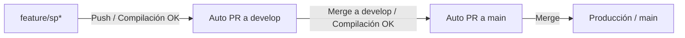

# 📖 GrowUp - Plataforma de Manga, Anime y Novelas Ligeras

[](https://github.com/MiguelCarlosRojas/GrowUp/actions/workflows/ci.yml)
[](https://www.python.org/)
[](https://www.djangoproject.com/)
[](https://www.prisma.io/postgres)
[](https://jikan.moe/)

---

### 🏷️ Metadatos del Repositorio de GitHub

> **Description:**  
> Plataforma interactiva de Manga, Anime y Novelas Ligeras desarrollada en Django puro con Prisma Postgres, Jikan API v4, Taller de Escritores, sistema de reseñas y CI/CD automatizado con GitHub Actions.
>
> **Website:**  
> `https://growup-anime.vercel.app`
>
> **Topics:**  
> `django`, `python`, `anime`, `manga`, `light-novels`, `jikan-api`, `prisma-postgres`, `github-actions`, `cicd`, `web-development`, `postgresql`

---

## 🌟 Características Principales

1. **Catálogo & Landing Page Dinámica:**
   - Información real y actualizada en tiempo real mediante **Jikan API v4** (MyAnimeList).
   - Obras maestras y estrenos de anime, manga y novelas ligeras oficiales.
   - Variedad amplia de filtros interactivos: por tipo de obra (Anime, Manga, Novela Ligera, Novelas de la Comunidad), término de búsqueda, géneros múltiples, estado de emisión y criterios de ordenamiento (mayor puntuación, popularidad, orden alfabético).

2. **Base de Datos con Prisma Postgres:**
   - Configuración lista para **Prisma Postgres** / PostgreSQL en producción mediante variables de entorno seguras (`DATABASE_URL`).
   - Modo de resiliencia con fallback a SQLite local para testing y CI sin dependencias de red externas.

3. **Sistema de Clasificación, Opiniones y Discusiones (Q&A):**
   - Calificación interactiva de 1 a 5 estrellas con cálculo automático de promedios de la comunidad.
   - Reseñas con título y opinión detallada.
   - Foro de discusión por obra: comentarios generales y preguntas con hilos de respuestas anidadas.

4. **Taller de Escritores (Novelas Ligeras Originales):**
   - Módulo para autores donde pueden subir sus obras completas:
     - Título, sinopsis, imagen de portada (archivo o URL), demografía, idioma y categorías/géneros (Isekai, Fantasía, Acción, Romance, etc.).
     - Gestión de capítulos: numeración, título, contenido completo, conteo de palabras y notas del autor.
     - Lector web de capítulos integrado con control de tamaño de fuente y navegación secuencial.

5. **Autenticación & Perfiles:**
   - Registro con selección de rol (Lector o Escritor).
   - Login, logout y gestión de perfil (biografía, géneros preferidos, historial de reseñas y panel de autor).

---

## 🏗️ Flujo de Ramas & Automatización CI/CD con GitHub Actions

El repositorio cuenta con integración continua (CI) y automatización total del ciclo de entrega:



- **`feature/**`:** Ramas de trabajo donde se desarrollan las nuevas características.
- **Workflow `Auto PR Feature to Develop`:** Al hacer `git push` a cualquier rama `feature/**`, GitHub Actions compila el proyecto y ejecuta la suite de pruebas. Si todo es exitoso, crea automáticamente el Pull Request hacia la rama `develop`.
- **Workflow `Auto PR Develop to Main`:** Al consolidar cambios en `develop`, si el proyecto compila y pasa todas las verificaciones, se genera automáticamente el Pull Request hacia la rama `main`.

---

## 🚀 Instalación y Ejecución Local

### Prerrequisitos
- Python 3.12 o superior.
- Git.

### 1. Clonar el repositorio y acceder
```bash
git clone https://github.com/MiguelCarlosRojas/GrowUp.git
cd GrowUp
```

### 2. Crear y activar entorno virtual
```bash
# Windows
python -m venv .venv
.\.venv\Scripts\activate

# Linux / macOS
python3 -m venv .venv
source .venv/bin/activate
```

### 3. Instalar dependencias
```bash
pip install -r requirements.txt
```

### 4. Configurar Variables de Entorno
Copia la plantilla `.env.example` a `.env`:
```bash
cp .env.example .env
```
Edita `.env` con tus credenciales de Prisma Postgres o PostgreSQL si lo deseas (o déjalo en blanco para usar la base de datos SQLite predeterminada).

> ⚠️ **Seguridad:** El archivo `.env` nunca debe subirse al repositorio. Está protegido en `.gitignore`.

### 5. Aplicar migraciones y datos iniciales
```bash
python manage.py migrate
python manage.py seed_categories
```

### 6. Ejecutar pruebas unitarias
```bash
python manage.py test
```

### 7. Iniciar el servidor de desarrollo
```bash
python manage.py runserver
```
Accede en tu navegador a: `http://127.0.0.1:8000/`

---

## 📁 Estructura del Proyecto

```text
GrowUp/
├── .github/
│   ├── workflows/
│   │   ├── ci.yml                           # Workflow de verificación continua
│   │   ├── auto-pr-feature-to-develop.yml   # PR automático feature -> develop
│   │   └── auto-pr-develop-to-main.yml      # PR automático develop -> main
│   ├── ISSUE_TEMPLATE/                      # Plantillas de issues de GitHub
│   └── pull_request_template.md             # Plantilla de Pull Request
├── accounts/                                # Autenticación, roles y perfil
├── catalog/                                 # Landing page, Jikan API, filtros, reseñas y Q&A
├── novels/                                  # Taller de escritores, novelas ligeras y lector
├── growup/                                  # Configuración central Django (settings, urls, wsgi)
├── templates/                               # Plantillas HTML con Bootstrap 5 & Dark Theme
├── static/                                  # Archivos estáticos (CSS, JS, iconos)
├── .env.example                             # Plantilla pública de variables de entorno
├── CODE_OF_CONDUCT.md                       # Código de conducta para la comunidad
├── COPYRIGHT.md                             # Declaración de derechos de autor y Jikan
├── requirements.txt                         # Dependencias del proyecto
└── manage.py                                # Gestor CLI de Django
```

---

## 📄 Licencia y Conducta
Consulta [COPYRIGHT.md](COPYRIGHT.md) y [CODE_OF_CONDUCT.md](CODE_OF_CONDUCT.md) para más detalles.
